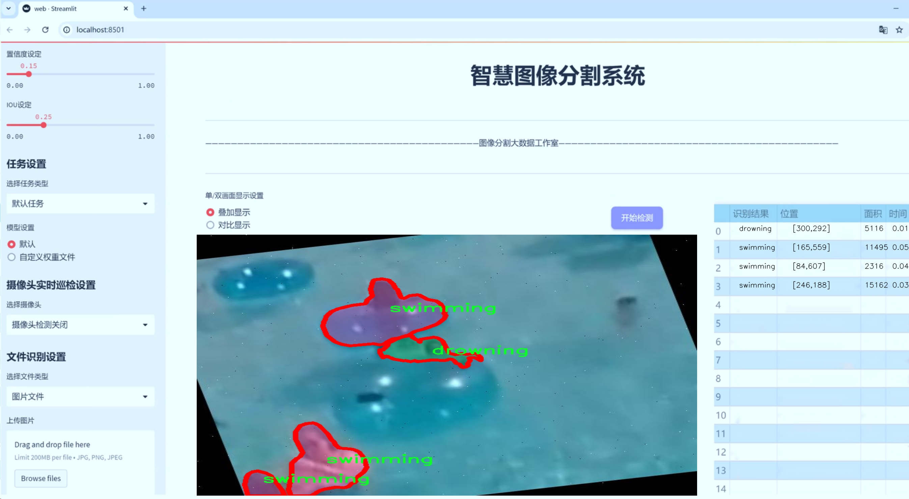
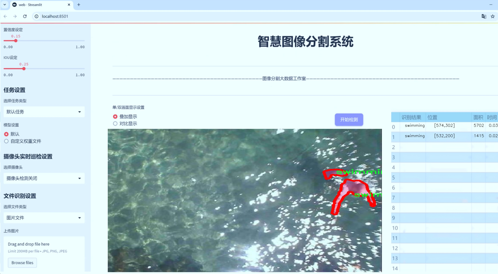
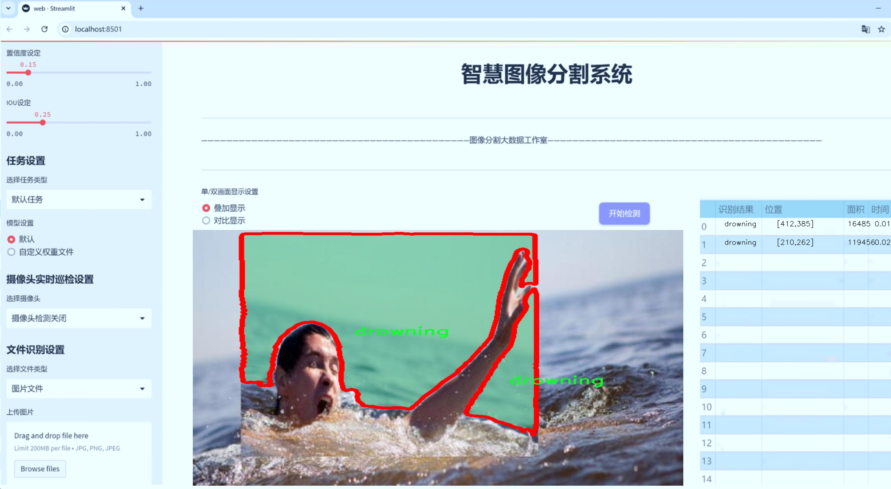
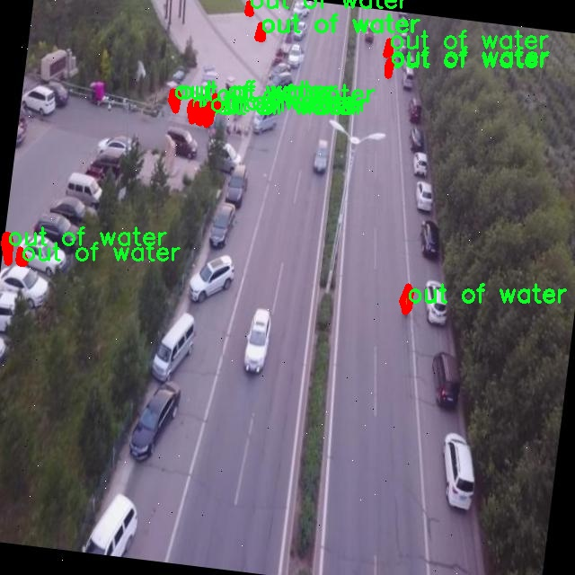
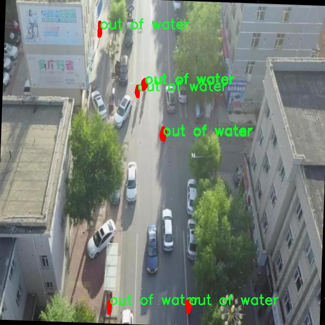
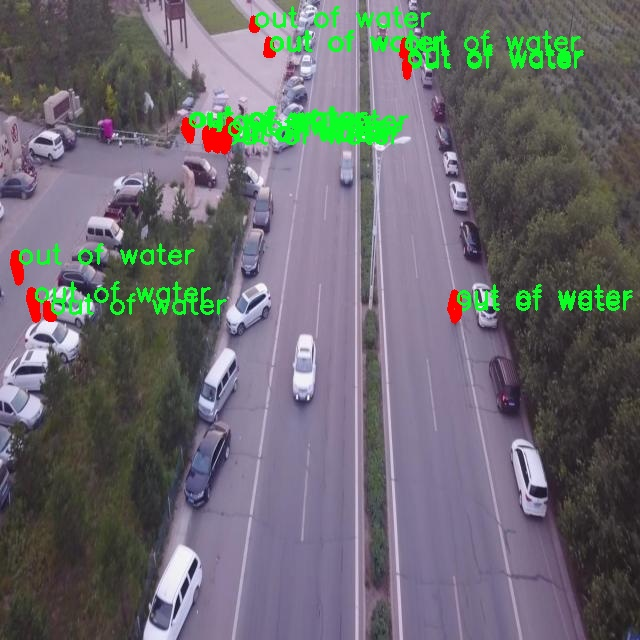
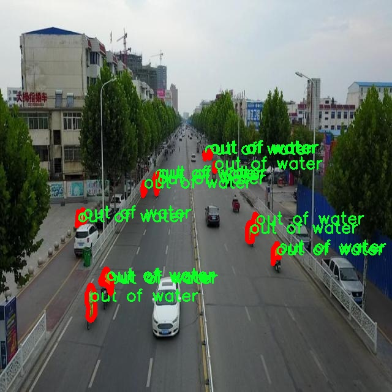
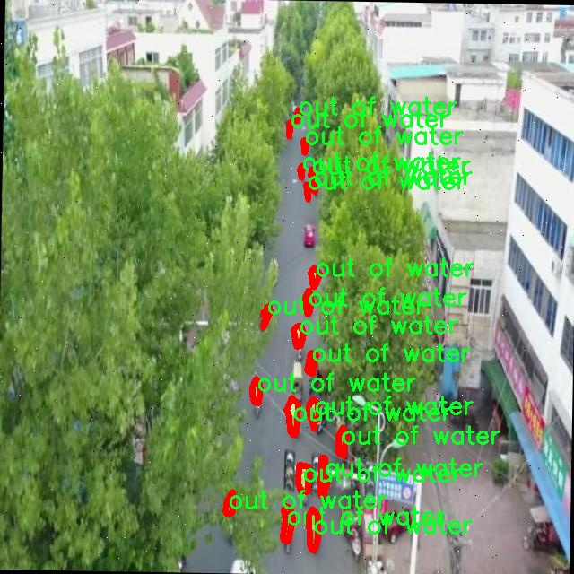

# 溺水检测场景分割系统源码＆数据集分享
 [yolov8-seg-ContextGuidedDown＆yolov8-seg-AFPN-P345等50+全套改进创新点发刊_一键训练教程_Web前端展示]

### 1.研究背景与意义

项目参考[ILSVRC ImageNet Large Scale Visual Recognition Challenge](https://gitee.com/YOLOv8_YOLOv11_Segmentation_Studio/projects)

项目来源[AAAI Global Al lnnovation Contest](https://kdocs.cn/l/cszuIiCKVNis)

研究背景与意义

随着全球水域活动的增加，溺水事故的发生频率逐年上升，尤其是在儿童和青少年群体中，溺水已成为导致意外死亡的重要原因之一。根据世界卫生组织的统计数据，溺水是全球范围内造成5岁以下儿童死亡的第二大原因。因此，及时有效地监测和预防溺水事件显得尤为重要。近年来，计算机视觉技术的快速发展为溺水检测提供了新的解决方案，尤其是基于深度学习的目标检测和场景分割技术，为实时监测水域安全提供了强有力的支持。

在众多深度学习模型中，YOLO（You Only Look Once）系列模型因其高效的实时检测能力而备受关注。YOLOv8作为该系列的最新版本，进一步提升了检测精度和速度，尤其在复杂场景下的表现尤为突出。然而，传统的YOLOv8模型在处理溺水检测任务时，仍然面临一些挑战，如背景复杂性、目标遮挡以及多类目标的识别等。因此，基于改进YOLOv8的溺水检测场景分割系统的研究具有重要的现实意义。

本研究所使用的数据集包含1000张图像，涵盖了三类重要的场景：溺水、出水和游泳。这些类别不仅反映了水域活动的多样性，也为模型的训练和评估提供了丰富的样本。通过对这些图像进行实例分割，可以更准确地识别和定位溺水者及其周围环境，从而实现对溺水事件的实时监测与预警。此外，场景分割技术能够帮助系统更好地理解水域环境，识别潜在的危险因素，如水深、流速等，从而为安全管理提供数据支持。

在实际应用中，基于改进YOLOv8的溺水检测系统可以集成到监控摄像头中，实时分析水域活动，自动识别溺水者并发出警报。这一系统的实现不仅可以提高救援效率，减少溺水事故的发生，还可以为相关部门提供决策支持，优化水域安全管理。此外，研究成果还可以为后续的智能监控系统开发提供理论基础和技术参考，推动计算机视觉技术在公共安全领域的应用。

综上所述，基于改进YOLOv8的溺水检测场景分割系统的研究，不仅具有重要的学术价值，也具有广泛的社会意义。通过深入探讨深度学习在溺水检测中的应用，我们期望能够为降低溺水事故的发生率贡献一份力量，同时推动相关技术的进步与发展。

### 2.图片演示







##### 注意：由于此博客编辑较早，上面“2.图片演示”和“3.视频演示”展示的系统图片或者视频可能为老版本，新版本在老版本的基础上升级如下：（实际效果以升级的新版本为准）

  （1）适配了YOLOV8的“目标检测”模型和“实例分割”模型，通过加载相应的权重（.pt）文件即可自适应加载模型。

  （2）支持“图片识别”、“视频识别”、“摄像头实时识别”三种识别模式。

  （3）支持“图片识别”、“视频识别”、“摄像头实时识别”三种识别结果保存导出，解决手动导出（容易卡顿出现爆内存）存在的问题，识别完自动保存结果并导出到tempDir中。

  （4）支持Web前端系统中的标题、背景图等自定义修改，后面提供修改教程。

  另外本项目提供训练的数据集和训练教程,暂不提供权重文件（best.pt）,需要您按照教程进行训练后实现图片演示和Web前端界面演示的效果。

### 3.视频演示

[3.1 视频演示](https://www.bilibili.com/video/BV1HeyuYmEUq/)

### 4.数据集信息展示

##### 4.1 本项目数据集详细数据（类别数＆类别名）

nc: 3
names: ['drowning', 'out of water', 'swimming']


##### 4.2 本项目数据集信息介绍

数据集信息展示

在现代计算机视觉领域，尤其是在安全监测和公共安全方面，溺水检测的研究愈发受到重视。为此，构建一个高效且准确的溺水检测场景分割系统显得尤为重要。本项目所使用的数据集名为“Drowning Detection Main”，该数据集专门为训练和改进YOLOv8-seg模型而设计，旨在提升其在复杂水域环境中的表现。

“Drowning Detection Main”数据集包含三种主要类别，分别是“溺水”（drowning）、“出水”（out of water）和“游泳”（swimming）。这三类标签的设定不仅涵盖了溺水事件的不同状态，还为模型提供了丰富的上下文信息，以便于在实际应用中进行更为精确的场景分割和目标检测。具体而言，“溺水”类别代表了个体在水中遇险的状态，通常伴随着特定的行为模式和身体姿态；“出水”类别则指个体已经脱离水面，通常表示溺水事件的结束或成功救援；而“游泳”类别则描绘了个体在水中正常活动的状态，这一类别的存在有助于模型区分正常的水中活动与潜在的危险行为。

数据集的构建过程注重多样性和代表性，涵盖了不同的水域环境，包括游泳池、海洋、湖泊等多种场景。每个类别的数据样本均经过精心标注，确保在训练过程中模型能够准确学习到各类行为的特征。为了增强模型的泛化能力，数据集中还包含了不同光照条件、天气状况和拍摄角度下的图像，这些变化能够有效模拟现实世界中可能遇到的各种情况。

在数据预处理阶段，图像被标准化处理，以适应YOLOv8-seg模型的输入要求。数据增强技术的应用，如随机裁剪、旋转、翻转等，进一步丰富了训练样本的多样性，提升了模型在面对未知数据时的鲁棒性。此外，数据集还包含了大量的背景图像，以帮助模型更好地理解场景的上下文，从而减少误报率。

为了评估模型的性能，数据集还划分出了验证集和测试集。这些数据集的设计不仅确保了训练过程中的有效性，也为后续的模型调优和性能评估提供了可靠的依据。通过对“Drowning Detection Main”数据集的深入分析与应用，研究人员能够不断优化YOLOv8-seg模型的结构和参数，进而提升其在实际溺水检测场景中的应用效果。

总之，“Drowning Detection Main”数据集的构建与应用，为溺水检测技术的发展提供了坚实的基础。通过精确的场景分割和目标检测，该数据集不仅能够帮助提高溺水事件的响应速度，还能为相关安全监测系统的研发提供重要的数据支持。随着技术的不断进步，期待这一领域能够取得更大的突破，为公共安全做出更大的贡献。











### 5.全套项目环境部署视频教程（零基础手把手教学）

[5.1 环境部署教程链接（零基础手把手教学）](https://www.bilibili.com/video/BV1jG4Ve4E9t/?vd_source=bc9aec86d164b67a7004b996143742dc)


[5.2 安装Python虚拟环境创建和依赖库安装视频教程链接（零基础手把手教学）](https://www.bilibili.com/video/BV1nA4VeYEze/?vd_source=bc9aec86d164b67a7004b996143742dc)

### 6.手把手YOLOV8-seg训练视频教程（零基础小白有手就能学会）

[6.1 手把手YOLOV8-seg训练视频教程（零基础小白有手就能学会）](https://www.bilibili.com/video/BV1cA4VeYETe/?vd_source=bc9aec86d164b67a7004b996143742dc)


按照上面的训练视频教程链接加载项目提供的数据集，运行train.py即可开始训练



     Epoch   gpu_mem       box       obj       cls    labels  img_size
     1/200     0G   0.01576   0.01955  0.007536        22      1280: 100%|██████████| 849/849 [14:42<00:00,  1.04s/it]
               Class     Images     Labels          P          R     mAP@.5 mAP@.5:.95: 100%|██████████| 213/213 [01:14<00:00,  2.87it/s]
                 all       3395      17314      0.994      0.957      0.0957      0.0843

     Epoch   gpu_mem       box       obj       cls    labels  img_size
     2/200     0G   0.01578   0.01923  0.007006        22      1280: 100%|██████████| 849/849 [14:44<00:00,  1.04s/it]
               Class     Images     Labels          P          R     mAP@.5 mAP@.5:.95: 100%|██████████| 213/213 [01:12<00:00,  2.95it/s]
                 all       3395      17314      0.996      0.956      0.0957      0.0845

     Epoch   gpu_mem       box       obj       cls    labels  img_size
     3/200     0G   0.01561    0.0191  0.006895        27      1280: 100%|██████████| 849/849 [10:56<00:00,  1.29it/s]
               Class     Images     Labels          P          R     mAP@.5 mAP@.5:.95: 100%|███████   | 187/213 [00:52<00:00,  4.04it/s]
                 all       3395      17314      0.996      0.957      0.0957      0.0845


### 7.50+种全套YOLOV8-seg创新点代码加载调参视频教程（一键加载写好的改进模型的配置文件）

[7.1 50+种全套YOLOV8-seg创新点代码加载调参视频教程（一键加载写好的改进模型的配置文件）](https://www.bilibili.com/video/BV1Hw4VePEXv/?vd_source=bc9aec86d164b67a7004b996143742dc)

### 8.YOLOV8-seg图像分割算法原理

原始YOLOV8-seg算法原理

YOLOV8-seg算法是YOLO系列中最新的一个重要变种，专注于目标检测与分割任务的结合。该算法在YOLOv8的基础上，采用了anchor-free的检测方法，旨在提高检测精度和速度。YOLOV8-seg的设计理念源于对目标检测领域的深刻理解，尤其是在复杂背景下小目标的检测和分割。传统的anchor-based方法在处理小目标时常常面临定位误差和感知能力不足的问题，这在水面环境等复杂场景中尤为明显。为了解决这些问题，YOLOV8-seg在算法架构和损失函数上进行了多方面的改进。

首先，YOLOV8-seg的输入端采用了多种数据增强技术，如Mosaic数据增强、自适应图片缩放和灰度填充等。这些技术不仅能够提高模型的鲁棒性，还能有效增加训练样本的多样性，从而提升模型在复杂环境下的表现。输入图像经过这些预处理后，进入主干网络进行特征提取。主干网络由多个卷积层、C2f模块和SPPF结构组成，C2f模块的设计灵感来源于YOLOv7的ELAN结构，通过多分支的跨层连接，显著增强了模型的梯度流动性，使得特征表示能力得到了提升。SPPF模块则通过空间金字塔池化技术，进一步提高了模型的计算速度和特征提取能力。

在特征提取完成后，YOLOV8-seg进入Neck端，采用了路径聚合网络（PAN）结构。该结构通过上采样和下采样的方式，将不同尺度的特征图进行融合，确保模型能够有效捕捉到不同大小目标的特征信息。这一设计对于小目标的检测尤为重要，因为小目标往往在特征图中表现得不够明显，容易被忽视。YOLOV8-seg通过这种多尺度特征融合的方式，增强了对小目标的感知能力。

输出端则采用了解耦头结构，分别处理分类和回归任务。通过Task-Aligned Assigner方法，YOLOV8-seg能够根据分类分数和回归分数的加权结果进行正样本匹配。这种解耦设计不仅提高了模型的灵活性，还使得损失计算更加高效。分类损失采用二元交叉熵损失（BCE），而回归损失则结合了分布焦点损失（DFL）和完全交并比损失（CIoU），进一步提升了模型在边界框预测方面的精准度。

为了应对复杂水面环境下小目标的检测挑战，YOLOV8-seg引入了BiFormer双层路由注意力机制，构建了C2fBF模块。这一模块旨在减轻主干网络下采样过程中的噪声影响，保留更细粒度的上下文信息。通过捕获远程依赖，C2fBF模块能够有效提升模型对小目标的感知能力，减少漏检现象的发生。此外，YOLOV8-seg还在Neck端引入了GSConv和Slim-neck技术，这些技术不仅保持了模型的精度，还有效降低了计算量，使得YOLOV8-seg在保持高性能的同时，具备了更好的实时性。

在损失函数的选择上，YOLOV8-seg使用了MPDIoU损失函数替代了CIoU损失函数。MPDIoU损失函数在传统IoU的基础上，考虑了多个维度的信息，使得模型在处理复杂场景时具备更强的泛化能力和精准度。这一改进使得YOLOV8-seg在小目标检测和分割任务中表现得更加出色，尤其是在水面等复杂环境下，能够有效降低定位误差，提高目标感知能力。

综上所述，YOLOV8-seg算法通过多层次的设计改进和技术创新，成功克服了传统YOLO模型在复杂环境下的不足之处。其在特征提取、特征融合、目标检测和损失计算等多个方面的优化，使得YOLOV8-seg不仅在检测精度上有了显著提升，同时也在处理速度上达到了更高的标准。这一算法的成功实施，为未来在更广泛的应用场景中，尤其是在复杂背景下的小目标检测与分割任务提供了新的思路和方法。随着YOLOV8-seg的不断发展和完善，期待其在实际应用中展现出更为卓越的性能。


### 9.系统功能展示（检测对象为举例，实际内容以本项目数据集为准）

图9.1.系统支持检测结果表格显示

  图9.2.系统支持置信度和IOU阈值手动调节

  图9.3.系统支持自定义加载权重文件best.pt(需要你通过步骤5中训练获得)

  图9.4.系统支持摄像头实时识别

  图9.5.系统支持图片识别

  图9.6.系统支持视频识别

  图9.7.系统支持识别结果文件自动保存

  图9.8.系统支持Excel导出检测结果数据


### 10.50+种全套YOLOV8-seg创新点原理讲解（非科班也可以轻松写刊发刊，V11版本正在科研待更新）

#### 10.1 由于篇幅限制，每个创新点的具体原理讲解就不一一展开，具体见下列网址中的创新点对应子项目的技术原理博客网址【Blog】：


[10.1 50+种全套YOLOV8-seg创新点原理讲解链接](https://gitee.com/qunmasj/good)

#### 10.2 部分改进模块原理讲解(完整的改进原理见上图和技术博客链接)【如果此小节的图加载失败可以通过CSDN或者Github搜索该博客的标题访问原始博客，原始博客图片显示正常】
### 深度学习基础
卷积神经网络通过使用具有共享参数的卷积运算显著降低了模型的计算开销和复杂性。在LeNet、AlexNet和VGG等经典网络的驱动下，卷积神经网络现在已经建立了一个完整的系统，并在深度学习领域形成了先进的卷积神经网络模型。

感受野注意力卷积RFCBAMConv的作者在仔细研究了卷积运算之后获得了灵感。对于分类、目标检测和语义分割任务，一方面，图像中不同位置的对象的形状、大小、颜色和分布是可变的。在卷积操作期间，卷积核在每个感受野中使用相同的参数来提取信息，而不考虑来自不同位置的差分信息。这限制了网络的性能，这已经在最近的许多工作中得到了证实。

另一方面，卷积运算没有考虑每个特征的重要性，这进一步影响了提取特征的有效性，并最终限制了模型的性能。此外，注意力机制允许模型专注于重要特征，这可以增强特征提取的优势和卷积神经网络捕获详细特征信息的能力。因此，注意力机制在深度学习中得到了广泛的应用，并成功地应用于各个领域。

通过研究卷积运算的内在缺陷和注意力机制的特点，作者认为现有的空间注意力机制从本质上解决了卷积运算的参数共享问题，但仍局限于对空间特征的认知。对于较大的卷积核，现有的空间注意力机制并没有完全解决共享参数的问题。此外，他们无法强调感受野中每个特征的重要性，例如现有的卷积块注意力模块（CBAM）和 Coordinate注意力（CA）。

因此，[参考该博客提出了一种新的感受野注意力机制（RFA）](https://qunmasj.com)，它完全解决了卷积核共享参数的问题，并充分考虑了感受野中每个特征的重要性。通过RFA设计的卷积运算（RFAConv）是一种新的卷积运算，可以取代现有神经网络中的标准卷积运算。RFAConv通过添加一些参数和计算开销来提高网络性能。

大量关于Imagnet-1k、MS COCO和VOC的实验已经证明了RFAConv的有效性。作为一种由注意力构建的新型卷积运算，它超过了由CAM、CBAM和CA构建的卷积运算（CAMConv、CBAMConv、CAConv）以及标准卷积运算。

此外，为了解决现有方法提取感受野特征速度慢的问题，提出了一种轻量级操作。在构建RFAConv的过程中，再次设计了CA和CBAM的升级版本，并进行了相关实验。作者认为当前的空间注意力机制应该将注意力放在感受野空间特征上，以促进当前空间注意力机制的发展，并再次增强卷积神经网络架构的优势。


### 卷积神经网络架构
出色的神经网络架构可以提高不同任务的性能。卷积运算作为卷积神经网络的一种基本运算，推动了人工智能的发展，并为车辆检测、无人机图像、医学等先进的网络模型做出了贡献。He等人认为随着网络深度的增加，该模型将变得难以训练并产生退化现象，因此他们提出了残差连接来创新卷积神经网络架构的设计。Huang等人通过重用特征来解决网络梯度消失问题，增强了特征信息，他们再次创新了卷积神经网络架构。

通过对卷积运算的详细研究，Dai等人认为，具有固定采样位置的卷积运算在一定程度上限制了网络的性能，因此提出了Deformable Conv，通过学习偏移来改变卷积核的采样位置。在Deformable Conv的基础上，再次提出了Deformable Conv V2和Deformable Conv V3，以提高卷积网络的性能。

Zhang等人注意到，组卷积可以减少模型的参数数量和计算开销。然而，少于组内信息的交互将影响最终的网络性能。1×1的卷积可以与信息相互作用。然而，这将带来更多的参数和计算开销，因此他们提出了无参数的“通道Shuffle”操作来与组之间的信息交互。

Ma等人通过实验得出结论，对于参数较少的模型，推理速度不一定更快，对于计算量较小的模型，推理也不一定更快。经过仔细研究提出了Shufflenet V2。

YOLO将输入图像划分为网格，以预测对象的位置和类别。经过不断的研究，已经提出了8个版本的基于YOLO的目标检测器，如YOLOv5、YOLOv7、YOLOv8等。上述卷积神经网络架构已经取得了巨大的成功。然而，它们并没有解决提取特征过程中的参数共享问题。本文的工作从注意力机制开始，从一个新的角度解决卷积参数共享问题。

### 注意力机制
注意力机制被用作一种提高网络模型性能的技术，使其能够专注于关键特性。注意力机制理论已经在深度学习中建立了一个完整而成熟的体系。Hu等人提出了一种Squeeze-and-Excitation（SE）块，通过压缩特征来聚合全局通道信息，从而获得与每个通道对应的权重。Wang等人认为，当SE与信息交互时，单个通道和权重之间的对应关系是间接的，因此设计了高效通道注Efficient Channel Attention力（ECA），并用自适应kernel大小的一维卷积取代了SE中的全连接（FC）层。Woo等人提出了卷积块注意力模块（CBAM），它结合了通道注意力和空间注意力。作为一个即插即用模块，它可以嵌入卷积神经网络中，以提高网络性能。

尽管SE和CBAM已经提高了网络的性能。Hou等人仍然发现压缩特征在SE和CBAM中丢失了太多信息。因此，他们提出了轻量级Coordinate注意力（CA）来解决SE和CBAM中的问题。Fu等人计了一个空间注意力模块和通道注意力模块，用于扩展全卷积网络（FCN），分别对空间维度和通道维度的语义相关性进行建模。Zhang等人在通道上生成不同尺度的特征图，以建立更有效的通道注意力机制。

本文从一个新的角度解决了标准卷积运算的参数共享问题。这就是将注意力机制结合起来构造卷积运算。尽管目前的注意力机制已经获得了良好的性能，但它们仍然没有关注感受野的空间特征。因此，设计了具有非共享参数的RFA卷积运算，以提高网络的性能。


#### 回顾标准卷积
以标准卷积运算为基础构建卷积神经网络，通过共享参数的滑动窗口提取特征信息，解决了全连接层构建的神经网络的固有问题（即参数数量大、计算开销高）。

设表示输入特征图，其中、和分别表示特征图的通道数、高度和宽度。为了能够清楚地展示卷积核提取特征信息的过程，以为例。提取每个感受野slider的特征信息的卷积运算可以表示如下：


这里，表示在每次卷积slider操作之后获得的值，表示在每个slider内的相应位置处的像素值。表示卷积核，表示卷积核中的参数数量，表示感受野slider的总数。

可以看出，每个slider内相同位置的特征共享相同的参数。因此，标准的卷积运算无法感知不同位置带来的差异信息，这在一定程度上限制了卷积神经网络的性能。

#### 回顾空间注意力
目前，空间注意力机制使用通过学习获得的注意力图来突出每个特征的重要性。与上一节类似，以为例。突出关键特征的空间注意力机制可以简单地表达如下：


这里，表示在加权运算之后获得的值。和分别表示输入特征图和学习注意力图在不同位置的值，是输入特征图的高度和宽度的乘积，表示像素值的总数。一般来说，整个过程可以简单地表示在图1中。


#### 空间注意力与标准卷积
众所周知，将注意力机制引入卷积神经网络可以提高网络的性能。通过标准的卷积运算和对现有空间注意力机制的仔细分析。作者认为空间注意力机制本质上解决了卷积神经网络的固有缺点，即共享参数的问题。

目前，该模型最常见的卷积核大小为1×1和3×3。引入空间注意力机制后用于提取特征的卷积操作是1×1或3×3卷积操作。这个过程可以直观地显示出来。空间注意力机制被插入到1×1卷积运算的前面。通过注意力图对输入特征图进行加权运算（Re-weight“×”），最后通过1×1卷积运算提取感受野的slider特征信息。

整个过程可以简单地表示如下：


 

这里，卷积核仅表示一个参数值。如果将的值作为一个新的卷积核参数，那么有趣的是，通过1×1卷积运算提取特征时的参数共享问题得到了解决。然而，空间注意力机制的传说到此结束。当空间注意力机制被插入到3×3卷积运算的前面时。具体情况如下：


如上所述，如果取的值。作为一种新的卷积核参数，上述方程完全解决了大规模卷积核的参数共享问题。然而，最重要的一点是，卷积核在每个感受野slider中提取将共享部分特征的特征。换句话说，在每个感受野slider内都会有重叠。

经过仔细分析发现，，…，空间注意力图的权重在每个slider内共享。因此，空间注意机制不能解决大规模卷积核共享参数的问题，因为它们不注意感受野的空间特征。在这种情况下，空间注意力机制是有限的。
#### 创新空间注意力与标准卷积
RFA是为了解决空间注意力机制问题而提出的，创新了空间注意力。使用与RFA相同的思想，一系列空间注意力机制可以再次提高性能。RFA设计的卷积运算可以被视为一种轻量级的即插即用模块，以取代标准卷积，从而提高卷积神经网络的性能。因此，作者认为空间注意力机制和标准卷积在未来将有一个新的春天。

感受野的空间特征：

现在给出感受野空间特征的定义。它是专门为卷积核设计的，并根据kernel大小动态生成，如图2所示，以3×3卷积核为例。


在图2中，“空间特征”表示原始特征图，等于空间特征。“感受野空间特征”表示变换后的特征，该特征由每个感受野slider滑块组成，并且不重叠。也就是说，“感受野空间特征”中的每个3×3大小的slider表示提取原始3×3卷积特征时所有感觉野slider的特征。

#### 感受野注意力卷积(RFA):

关于感受野空间特征，该博客的作者提出了感受野注意（RFA），它不仅强调了感受野slider内各种特征的重要性，而且还关注感受野空间特性，以彻底解决卷积核参数共享的问题。感受野空间特征是根据卷积核的大小动态生成的，因此，RFA是卷积的固定组合，不能脱离卷积运算的帮助，卷积运算同时依赖RFA来提高性能。

因此，作者提出了感受野注意力卷积（RFAConv）。具有3×3大小卷积核的RFAConv的总体结构如图3所示。


目前，提取感受野特征最常用的方法速度较慢，因此经过不断探索提出了一种快速的方法，通过分组卷积来取代原来的方法。

具体来说，根据感受野大小，使用相应的组卷积大小来动态生成展开特征。尽管与原始的无参数方法（如Pytorch提供的nn.Unfld()）相比，该方法添加了一些参数，但速度要快得多。

注意：正如在上一节中提到的，当原始的3×3卷积核提取特征时，感受野空间特征中的每个3×3大小的窗口表示所有感受野滑块的特征。但在快速分组卷积提取感受野特征后，由于原始方法太慢，它们会被映射到新的特征中。

最近的一些工作已经证明信息交互可以提高网络性能。类似地，对于RFAConv，与感受野特征信息交互以学习注意力图可以提高网络性能，但与每个感受野特征交互将带来额外的计算开销。为了确保少量的计算开销和参数数量，通过探索使用AvgPool池化每个感受野特征的全局信息，然后通过1×1组卷积运算与信息交互。最后，softmax用于强调感受野特征中每个特征的重要性。通常，RFA的计算可以表示为：


表示分组卷积，表示卷积核的大小，代表规范化，表示输入特征图，是通过将注意力图与变换的感受野空间特征相乘而获得的。

与CBAM和CA不同，RFA可以为每个感受野特征生成注意力图。标准卷积受到卷积神经网络性能的限制，因为共享参数的卷积运算对位置带来的差异信息不敏感。RFA完全可以解决这个问题，具体细节如下：


由于RFA获得的特征图是“调整形状”后不重叠的感受野空间特征，因此通过池化每个感受野滑块的特征信息来学习学习的注意力图。换句话说，RFA学习的注意力图不再在每个感受野slider内共享，并且是有效的。这完全解决了现有的CA和CBAM对大尺寸kernel的注意力机制中的参数共享问题。

同时，RFA给标准卷积核带来了相当大的好处，但调整形状后，特征的高度和宽度是k倍，需要进行k×k的stride卷积运算，才能提取特征信息。RFAConv创新了标准卷积运算。

此外，空间注意力机制将得到升级，因为作者认为现有的空间注意力机制应该专注于感受野空间特征，以提高网络的性能。众所周知，基于自注意力机制的网络模型取得了巨大的成功，因为它解决了卷积参数共享的问题，并对远程信息进行了建模，但基于自注意力机理的方法给模型带来了巨大的计算开销和复杂性。作者认为通过将一些现有空间注意力机制的注意力放在感受野空间特征中，它以轻量级的方式解决了自注意力机制的问题。

答案如下：

将关注感受野空间特征的空间注意力与卷积相匹配，完全解决了卷积参数共享的问题；

当前的空间注意力机制本身具有考虑远距离信息的特点，它们通过全局平均池化或全局最大池化来获得全局信息，这在一定程度上考虑了远距离信息。


为此，作者设计了一种新的CBAM和CA，称为RFACBAM和RFACA，它专注于感受野的空间特征。与RFA类似，使用stride为k的k×k的最终卷积运算来提取特征信息，具体结构如图4和图5所示，将这2种新的卷积方法称为RFCBAMConv和RFCAConv。比较原始的CBAM，使用SE注意力来代替RFCBAM中的CAM。因为这样可以减少计算开销。


此外，在RFCBAM中，通道和空间注意力不是在单独的步骤中执行的，因为通道和空间注意力是同时加权的，从而允许在每个通道上获得的注意力图是不同的。


### 11.项目核心源码讲解（再也不用担心看不懂代码逻辑）

#### 11.1 ultralytics\__init__.py

以下是经过精简和注释的核心代码部分：

```python
# Ultralytics YOLO 🚀, AGPL-3.0 license

# 定义当前版本
__version__ = '8.0.202'

# 从ultralytics.models模块导入各种模型
from ultralytics.models import RTDETR, SAM, YOLO  # 导入实时目标检测模型、分割模型和YOLO模型
from ultralytics.models.fastsam import FastSAM  # 导入快速分割模型
from ultralytics.models.nas import NAS  # 导入神经架构搜索模型

# 导入设置和检查工具
from ultralytics.utils import SETTINGS as settings  # 导入设置
from ultralytics.utils.checks import check_yolo as checks  # 导入YOLO检查工具
from ultralytics.utils.downloads import download  # 导入下载工具

# 定义模块的公开接口
__all__ = '__version__', 'YOLO', 'NAS', 'SAM', 'FastSAM', 'RTDETR', 'checks', 'download', 'settings'
```

### 代码注释说明：

1. **版本定义**：
   - `__version__` 变量用于定义当前库的版本号，方便用户和开发者了解使用的版本。

2. **模型导入**：
   - `from ultralytics.models import RTDETR, SAM, YOLO`：导入了不同类型的模型，包括实时目标检测（RTDETR）、分割（SAM）和YOLO（You Only Look Once）模型，后者是广泛使用的目标检测模型。
   - `from ultralytics.models.fastsam import FastSAM`：导入快速分割模型，用于提高分割任务的效率。
   - `from ultralytics.models.nas import NAS`：导入神经架构搜索模型，用于自动化模型架构的设计。

3. **工具导入**：
   - `from ultralytics.utils import SETTINGS as settings`：导入设置配置，可能包含模型训练和推理的相关参数。
   - `from ultralytics.utils.checks import check_yolo as checks`：导入YOLO模型的检查工具，用于验证模型的有效性和兼容性。
   - `from ultralytics.utils.downloads import download`：导入下载工具，可能用于下载模型权重或其他资源。

4. **公开接口**：
   - `__all__` 变量定义了模块的公开接口，指定了可以被外部访问的名称，便于使用 `from module import *` 语句时的导入管理。

这个文件是Ultralytics YOLO库的初始化文件，主要用于定义库的版本以及导入和暴露相关的模块和功能。首先，文件中定义了库的版本号为'8.0.202'，这有助于用户和开发者了解当前使用的库版本。

接下来，文件从`ultralytics.models`模块中导入了多个模型，包括RTDETR、SAM和YOLO。这些模型是Ultralytics YOLO库的核心部分，提供了不同的目标检测和分割功能。此外，还从`ultralytics.models.fastsam`中导入了FastSAM模型，这可能是一个针对速度优化的分割模型。再者，从`ultralytics.models.nas`中导入了NAS模型，可能与神经架构搜索相关，提供了一种自动化设计模型的方式。

在工具函数方面，文件从`ultralytics.utils`模块中导入了SETTINGS，可能用于配置和设置库的运行参数。同时，还导入了`check_yolo`函数，用于检查YOLO模型的有效性和兼容性。此外，`download`函数被导入，可能用于下载模型或数据集等资源。

最后，`__all__`变量被定义为一个元组，列出了该模块公开的接口，包括版本号、各种模型、检查函数、下载函数和设置。这使得在使用`from ultralytics import *`时，只会导入这些指定的内容，从而避免了命名冲突和不必要的导入。

总的来说，这个初始化文件为Ultralytics YOLO库提供了一个清晰的入口，方便用户使用库中的各种功能和模型。

#### 11.2 ui.py

以下是经过简化和注释的核心代码部分：

```python
import sys
import subprocess

def run_script(script_path):
    """
    使用当前 Python 环境运行指定的脚本。

    Args:
        script_path (str): 要运行的脚本路径

    Returns:
        None
    """
    # 获取当前 Python 解释器的路径
    python_path = sys.executable

    # 构建运行命令，使用 streamlit 运行指定的脚本
    command = f'"{python_path}" -m streamlit run "{script_path}"'

    # 执行命令并等待其完成
    result = subprocess.run(command, shell=True)
    
    # 检查命令执行结果，如果返回码不为0，则表示出错
    if result.returncode != 0:
        print("脚本运行出错。")

# 主程序入口
if __name__ == "__main__":
    # 指定要运行的脚本路径
    script_path = "web.py"  # 假设脚本在当前目录下

    # 调用函数运行脚本
    run_script(script_path)
```

### 代码注释说明：
1. **导入模块**：
   - `sys`：用于获取当前 Python 解释器的路径。
   - `subprocess`：用于执行外部命令。

2. **定义 `run_script` 函数**：
   - 接受一个参数 `script_path`，表示要运行的脚本路径。
   - 使用 `sys.executable` 获取当前 Python 解释器的路径。
   - 构建命令字符串，使用 `streamlit` 运行指定的脚本。
   - 使用 `subprocess.run` 执行命令，并等待其完成。
   - 检查命令的返回码，如果不为0，表示脚本运行出错，打印错误信息。

3. **主程序入口**：
   - 在 `__main__` 块中，指定要运行的脚本路径（这里假设脚本在当前目录下）。
   - 调用 `run_script` 函数执行脚本。

这个程序文件的主要功能是通过当前的 Python 环境来运行一个指定的脚本，具体是使用 Streamlit 框架来启动一个 Web 应用。首先，程序导入了必要的模块，包括 `sys`、`os` 和 `subprocess`，这些模块分别用于获取系统信息、操作文件系统和执行外部命令。

在 `run_script` 函数中，首先获取当前 Python 解释器的路径，这样可以确保在正确的环境中运行脚本。接着，构建一个命令字符串，该命令使用 Python 解释器来运行 Streamlit，并指定要运行的脚本路径。然后，使用 `subprocess.run` 方法执行这个命令。这个方法会在一个新的 shell 中运行命令，并等待其完成。如果命令执行返回的状态码不为零，表示脚本运行过程中出现了错误，程序会打印出相应的错误信息。

在文件的最后部分，使用 `if __name__ == "__main__":` 语句来确保只有在直接运行该文件时才会执行下面的代码。这部分代码指定了要运行的脚本路径，这里使用了 `abs_path` 函数来获取 `web.py` 文件的绝对路径。最后，调用 `run_script` 函数来执行指定的脚本。

总体来说，这个程序的目的是为了方便地启动一个 Streamlit Web 应用，确保在正确的 Python 环境中运行，并能够处理可能出现的错误。

#### 11.3 ultralytics\data\__init__.py

```python
# Ultralytics YOLO 🚀, AGPL-3.0 license

# 从当前模块导入基础数据集类
from .base import BaseDataset

# 从构建模块导入构建数据加载器、构建YOLO数据集和加载推理源的函数
from .build import build_dataloader, build_yolo_dataset, load_inference_source

# 从数据集模块导入分类数据集、语义数据集和YOLO数据集类
from .dataset import ClassificationDataset, SemanticDataset, YOLODataset

# 定义模块的公开接口，允许外部访问这些类和函数
__all__ = ('BaseDataset', 'ClassificationDataset', 'SemanticDataset', 'YOLODataset', 
           'build_yolo_dataset', 'build_dataloader', 'load_inference_source')
```

### 代码核心部分及注释说明：

1. **导入基础类和函数**：
   - `from .base import BaseDataset`：导入基础数据集类`BaseDataset`，该类可能包含数据集的基本功能和接口。
   - `from .build import build_dataloader, build_yolo_dataset, load_inference_source`：导入构建数据加载器和数据集的函数，这些函数用于初始化和准备数据供YOLO模型使用。

2. **导入特定数据集类**：
   - `from .dataset import ClassificationDataset, SemanticDataset, YOLODataset`：导入不同类型的数据集类，包括分类数据集、语义分割数据集和YOLO特定的数据集。这些类将用于处理不同任务的数据。

3. **定义模块的公开接口**：
   - `__all__`：这是一个特殊变量，定义了模块中哪些类和函数是公开的，允许用户在使用`from module import *`时只导入这些指定的内容。这有助于管理模块的命名空间和避免不必要的冲突。

这个程序文件是Ultralytics YOLO项目中的一个初始化文件，通常用于定义模块的公共接口。文件的开头包含了一条注释，表明该项目使用的是AGPL-3.0许可证，并且是Ultralytics YOLO的相关代码。

接下来，文件通过相对导入的方式引入了几个模块和类。首先，从`.base`模块中导入了`BaseDataset`类，这通常是一个基础数据集类，可能提供了一些通用的方法和属性，供其他数据集类继承和使用。然后，从`.build`模块中导入了三个函数：`build_dataloader`、`build_yolo_dataset`和`load_inference_source`。这些函数可能用于构建数据加载器、构建YOLO数据集以及加载推理所需的数据源。

此外，从`.dataset`模块中导入了三个数据集类：`ClassificationDataset`、`SemanticDataset`和`YOLODataset`。这些类分别用于处理不同类型的数据集，可能涉及分类任务、语义分割任务和YOLO特定的数据集格式。

最后，`__all__`变量定义了该模块的公共接口，列出了可以被外部导入的类和函数。这种做法有助于控制模块的可见性，确保用户只访问到那些经过明确声明的部分，从而提高代码的可维护性和可读性。

总体来说，这个文件的主要作用是组织和导出与数据集相关的功能和类，为其他模块提供一个清晰的接口。

#### 11.4 train.py

以下是代码中最核心的部分，并附上详细的中文注释：

```python
import os
import torch
import yaml
from ultralytics import YOLO  # 导入YOLO模型库

if __name__ == '__main__':  # 确保该模块被直接运行时才执行以下代码
    # 设置训练参数
    workers = 1  # 数据加载的工作进程数
    batch = 8  # 每个批次的样本数量，需根据显存和内存进行调整
    device = "0" if torch.cuda.is_available() else "cpu"  # 判断是否使用GPU

    # 获取数据集配置文件的绝对路径
    data_path = abs_path(f'datasets/data/data.yaml', path_type='current')

    # 读取YAML文件，保持原有顺序
    with open(data_path, 'r') as file:
        data = yaml.load(file, Loader=yaml.FullLoader)

    # 修改数据集中训练、验证和测试集的路径
    if 'train' in data and 'val' in data and 'test' in data:
        directory_path = os.path.dirname(data_path.replace(os.sep, '/'))  # 获取目录路径
        data['train'] = directory_path + '/train'  # 更新训练集路径
        data['val'] = directory_path + '/val'      # 更新验证集路径
        data['test'] = directory_path + '/test'    # 更新测试集路径

        # 将修改后的数据写回YAML文件
        with open(data_path, 'w') as file:
            yaml.safe_dump(data, file, sort_keys=False)

    # 加载YOLO模型配置和预训练权重
    model = YOLO(r"C:\codeseg\codenew\50+种YOLOv8算法改进源码大全和调试加载训练教程（非必要）\改进YOLOv8模型配置文件\yolov8-seg-C2f-Faster.yaml").load("./weights/yolov8s-seg.pt")

    # 开始训练模型
    results = model.train(
        data=data_path,  # 指定训练数据的配置文件路径
        device=device,  # 使用的设备（GPU或CPU）
        workers=workers,  # 数据加载的工作进程数
        imgsz=640,  # 输入图像的大小为640x640
        epochs=100,  # 训练100个epoch
        batch=batch,  # 每个批次的大小为8
    )
```

### 代码注释说明：
1. **导入必要的库**：导入了操作系统、PyTorch、YAML解析库和YOLO模型库。
2. **设置训练参数**：定义了数据加载的工作进程数、批次大小和设备类型（GPU或CPU）。
3. **获取数据集配置文件路径**：使用`abs_path`函数获取数据集的YAML配置文件的绝对路径。
4. **读取和修改YAML文件**：读取YAML文件内容，更新训练、验证和测试集的路径，并将修改后的内容写回文件。
5. **加载YOLO模型**：根据指定的配置文件和预训练权重加载YOLO模型。
6. **训练模型**：调用`model.train`方法开始训练，传入数据路径、设备、工作进程数、图像大小、训练轮数和批次大小等参数。


#### 11.4 ultralytics\utils\atss.py

以下是经过简化并注释的核心代码部分：

```python
import torch
import torch.nn as nn
import torch.nn.functional as F

def bbox_overlaps(bboxes1, bboxes2, mode='iou', is_aligned=False, eps=1e-6):
    """计算两个边界框集合之间的重叠程度。

    Args:
        bboxes1 (Tensor): 第一个边界框集合，形状为 (M, 4)。
        bboxes2 (Tensor): 第二个边界框集合，形状为 (N, 4)。
        mode (str): 计算方式，可以是 "iou"（交并比）、"iof"（前景交集）或 "giou"（广义交并比）。
        is_aligned (bool): 如果为 True，则 bboxes1 和 bboxes2 的数量必须相等。
        eps (float): 为了数值稳定性，添加到分母的值。

    Returns:
        Tensor: 返回重叠程度的矩阵，形状为 (M, N) 或 (M,)。
    """
    assert mode in ['iou', 'iof', 'giou'], f'不支持的模式 {mode}'
    assert (bboxes1.size(-1) == 4 or bboxes1.size(0) == 0)
    assert (bboxes2.size(-1) == 4 or bboxes2.size(0) == 0)

    # 获取边界框的数量
    rows = bboxes1.size(-2)
    cols = bboxes2.size(-2)
    if is_aligned:
        assert rows == cols

    if rows * cols == 0:
        return bboxes1.new_zeros((rows, cols)) if not is_aligned else bboxes1.new_zeros((rows,))

    # 计算每个边界框的面积
    area1 = (bboxes1[..., 2] - bboxes1[..., 0]) * (bboxes1[..., 3] - bboxes1[..., 1])
    area2 = (bboxes2[..., 2] - bboxes2[..., 0]) * (bboxes2[..., 3] - bboxes2[..., 1])

    # 计算重叠区域的左上角和右下角坐标
    lt = torch.max(bboxes1[..., :2], bboxes2[..., :2])  # 左上角
    rb = torch.min(bboxes1[..., 2:], bboxes2[..., 2:])  # 右下角

    # 计算重叠区域的宽和高
    wh = (rb - lt).clamp(min=0)  # 确保不小于0
    overlap = wh[..., 0] * wh[..., 1]  # 重叠面积

    # 计算并集
    union = area1 + area2 - overlap + eps  # 加上eps以避免除以零
    ious = overlap / union  # 计算IoU

    if mode == 'giou':
        # 计算广义IoU
        enclosed_lt = torch.min(bboxes1[..., :2], bboxes2[..., :2])
        enclosed_rb = torch.max(bboxes1[..., 2:], bboxes2[..., 2:])
        enclose_wh = (enclosed_rb - enclosed_lt).clamp(min=0)
        enclose_area = enclose_wh[..., 0] * enclose_wh[..., 1] + eps
        gious = ious - (enclose_area - union) / enclose_area
        return gious

    return ious  # 返回IoU或IoF

class ATSSAssigner(nn.Module):
    '''自适应训练样本选择分配器'''
    def __init__(self, topk=9, num_classes=80):
        super(ATSSAssigner, self).__init__()
        self.topk = topk  # 每个样本选择的最大候选框数量
        self.num_classes = num_classes  # 类别数量
        self.bg_idx = num_classes  # 背景类别索引

    @torch.no_grad()
    def forward(self, anc_bboxes, n_level_bboxes, gt_labels, gt_bboxes, mask_gt, pd_bboxes):
        """分配边界框和标签。

        Args:
            anc_bboxes (Tensor): 形状为 (num_total_anchors, 4) 的锚框。
            n_level_bboxes (List): 每个级别的边界框数量。
            gt_labels (Tensor): 形状为 (bs, n_max_boxes, 1) 的真实标签。
            gt_bboxes (Tensor): 形状为 (bs, n_max_boxes, 4) 的真实边界框。
            mask_gt (Tensor): 形状为 (bs, n_max_boxes, 1) 的真实框掩码。
            pd_bboxes (Tensor): 形状为 (bs, n_max_boxes, 4) 的预测边界框。

        Returns:
            target_labels (Tensor): 形状为 (bs, num_total_anchors) 的目标标签。
            target_bboxes (Tensor): 形状为 (bs, num_total_anchors, 4) 的目标边界框。
            target_scores (Tensor): 形状为 (bs, num_total_anchors, num_classes) 的目标分数。
            fg_mask (Tensor): 形状为 (bs, num_total_anchors) 的前景掩码。
        """
        self.n_anchors = anc_bboxes.size(0)  # 总锚框数量
        self.bs = gt_bboxes.size(0)  # 批次大小
        self.n_max_boxes = gt_bboxes.size(1)  # 最大边界框数量

        if self.n_max_boxes == 0:
            # 如果没有真实框，返回背景标签和零目标框
            device = gt_bboxes.device
            return (
                torch.full([self.bs, self.n_anchors], self.bg_idx).to(device),
                torch.zeros([self.bs, self.n_anchors, 4]).to(device),
                torch.zeros([self.bs, self.n_anchors, self.num_classes]).to(device),
                torch.zeros([self.bs, self.n_anchors]).to(device)
            )

        # 计算重叠和距离
        overlaps = bbox_overlaps(gt_bboxes.reshape([-1, 4]), anc_bboxes)
        overlaps = overlaps.reshape([self.bs, -1, self.n_anchors])
        distances, ac_points = dist_calculator(gt_bboxes.reshape([-1, 4]), anc_bboxes)
        distances = distances.reshape([self.bs, -1, self.n_anchors])

        # 选择候选框
        is_in_candidate, candidate_idxs = self.select_topk_candidates(distances, n_level_bboxes, mask_gt)
        overlaps_thr_per_gt, iou_candidates = self.thres_calculator(is_in_candidate, candidate_idxs, overlaps)

        # 选择正样本
        is_pos = torch.where(iou_candidates > overlaps_thr_per_gt.repeat([1, 1, self.n_anchors]),
                             is_in_candidate, torch.zeros_like(is_in_candidate))

        # 获取目标
        target_labels, target_bboxes, target_scores = self.get_targets(gt_labels, gt_bboxes, target_gt_idx, fg_mask)

        return target_labels, target_bboxes, target_scores, fg_mask.bool(), target_gt_idx

    # 其他辅助函数省略...
```

### 代码注释说明：
1. **bbox_overlaps**：计算两个边界框集合之间的重叠程度，包括 IoU 和 GIoU 的计算。
2. **ATSSAssigner**：自适应训练样本选择分配器，负责将锚框与真实框进行匹配，返回目标标签、边界框和分数。
3. **forward** 方法：实现了锚框与真实框的匹配逻辑，计算重叠和距离，并选择正样本和负样本。

这段代码的核心功能是计算边界框之间的重叠程度，并根据这些重叠程度进行样本选择和分配。

这个程序文件`ultralytics/utils/atss.py`主要实现了自适应训练样本选择（Adaptive Training Sample Selection，ATSS）分配器的功能。该文件包含多个函数和一个类，主要用于生成锚框、计算边界框之间的重叠度（IoU）、以及进行目标检测中的样本分配。

首先，`generate_anchors`函数用于根据特征图生成锚框。该函数接收特征图、特征图的步幅、网格单元大小、网格偏移、设备类型、是否为评估模式以及模式（anchor-free或anchor-based）等参数。根据这些参数，函数会计算出锚框的坐标，并返回锚框的点、步幅张量等信息。

接下来，`fp16_clamp`函数用于对张量进行上下限限制，特别是针对半精度浮点数（float16）的处理。由于在CPU上没有直接支持半精度的clamp操作，因此该函数首先将张量转换为float32进行限制，然后再转换回float16。

`bbox_overlaps`函数用于计算两个边界框集合之间的重叠度。该函数支持不同的重叠度计算模式（如IoU、IoF和GIoU），并且可以处理批量输入。它根据输入的边界框计算重叠区域、并返回相应的重叠度。

`cast_tensor_type`和`iou2d_calculator`函数则用于处理张量类型转换和计算2D边界框的重叠度。`dist_calculator`函数计算给定锚框和真实边界框之间的中心距离，返回距离和锚框的中心点。

`ATSSAssigner`类是整个文件的核心，负责自适应训练样本的选择。它的构造函数接收topk参数和类别数量，并初始化相关属性。在`forward`方法中，该类接收锚框、各级别的边界框、真实标签、真实边界框、掩码和预测边界框等信息，计算重叠度和距离，并选择候选框。通过阈值计算和目标框的选择，最终返回目标标签、目标边界框、目标分数和前景掩码。

总的来说，这个文件实现了在目标检测任务中，如何根据锚框和真实边界框的关系，智能地选择训练样本，以提高模型的性能。通过计算重叠度和距离，该程序能够有效地进行样本分配，为后续的训练提供支持。

#### 11.5 ultralytics\nn\backbone\convnextv2.py

以下是代码中最核心的部分，并附上详细的中文注释：

```python
import torch
import torch.nn as nn
import torch.nn.functional as F

class LayerNorm(nn.Module):
    """ 
    自定义的LayerNorm层，支持两种数据格式：channels_last（默认）和channels_first。
    channels_last对应的输入形状为(batch_size, height, width, channels)，
    而channels_first对应的输入形状为(batch_size, channels, height, width)。
    """
    def __init__(self, normalized_shape, eps=1e-6, data_format="channels_last"):
        super().__init__()
        # 权重和偏置参数
        self.weight = nn.Parameter(torch.ones(normalized_shape))
        self.bias = nn.Parameter(torch.zeros(normalized_shape))
        self.eps = eps
        self.data_format = data_format
        if self.data_format not in ["channels_last", "channels_first"]:
            raise NotImplementedError 
        self.normalized_shape = (normalized_shape, )
    
    def forward(self, x):
        # 根据数据格式进行不同的归一化处理
        if self.data_format == "channels_last":
            return F.layer_norm(x, self.normalized_shape, self.weight, self.bias, self.eps)
        elif self.data_format == "channels_first":
            u = x.mean(1, keepdim=True)  # 计算均值
            s = (x - u).pow(2).mean(1, keepdim=True)  # 计算方差
            x = (x - u) / torch.sqrt(s + self.eps)  # 标准化
            x = self.weight[:, None, None] * x + self.bias[:, None, None]  # 应用权重和偏置
            return x

class Block(nn.Module):
    """ 
    ConvNeXtV2的基本模块，包含深度可分离卷积、归一化、激活函数等。
    
    Args:
        dim (int): 输入通道数。
        drop_path (float): 随机深度率，默认值为0.0。
    """
    def __init__(self, dim, drop_path=0.):
        super().__init__()
        self.dwconv = nn.Conv2d(dim, dim, kernel_size=7, padding=3, groups=dim)  # 深度卷积
        self.norm = LayerNorm(dim, eps=1e-6)  # 归一化层
        self.pwconv1 = nn.Linear(dim, 4 * dim)  # 1x1卷积（用线性层实现）
        self.act = nn.GELU()  # 激活函数
        self.pwconv2 = nn.Linear(4 * dim, dim)  # 1x1卷积（用线性层实现）
        self.drop_path = nn.Identity() if drop_path <= 0. else DropPath(drop_path)  # 随机深度

    def forward(self, x):
        input = x  # 保存输入以便后续残差连接
        x = self.dwconv(x)  # 深度卷积
        x = x.permute(0, 2, 3, 1)  # 维度转换
        x = self.norm(x)  # 归一化
        x = self.pwconv1(x)  # 1x1卷积
        x = self.act(x)  # 激活
        x = self.pwconv2(x)  # 1x1卷积
        x = x.permute(0, 3, 1, 2)  # 恢复维度
        
        x = input + self.drop_path(x)  # 残差连接
        return x

class ConvNeXtV2(nn.Module):
    """ 
    ConvNeXt V2模型结构，包含多个阶段和模块。
    
    Args:
        in_chans (int): 输入图像的通道数，默认值为3。
        num_classes (int): 分类头的类别数，默认值为1000。
        depths (tuple(int)): 每个阶段的块数，默认值为[3, 3, 9, 3]。
        dims (int): 每个阶段的特征维度，默认值为[96, 192, 384, 768]。
        drop_path_rate (float): 随机深度率，默认值为0。
    """
    def __init__(self, in_chans=3, num_classes=1000, 
                 depths=[3, 3, 9, 3], dims=[96, 192, 384, 768], 
                 drop_path_rate=0.):
        super().__init__()
        self.depths = depths
        self.downsample_layers = nn.ModuleList()  # 下采样层
        # Stem部分
        stem = nn.Sequential(
            nn.Conv2d(in_chans, dims[0], kernel_size=4, stride=4),
            LayerNorm(dims[0], eps=1e-6, data_format="channels_first")
        )
        self.downsample_layers.append(stem)
        # 添加下采样层
        for i in range(3):
            downsample_layer = nn.Sequential(
                    LayerNorm(dims[i], eps=1e-6, data_format="channels_first"),
                    nn.Conv2d(dims[i], dims[i+1], kernel_size=2, stride=2),
            )
            self.downsample_layers.append(downsample_layer)

        self.stages = nn.ModuleList()  # 特征分辨率阶段
        dp_rates = [x.item() for x in torch.linspace(0, drop_path_rate, sum(depths))] 
        cur = 0
        # 添加多个Block
        for i in range(4):
            stage = nn.Sequential(
                *[Block(dim=dims[i], drop_path=dp_rates[cur + j]) for j in range(depths[i])]
            )
            self.stages.append(stage)
            cur += depths[i]

        self.norm = nn.LayerNorm(dims[-1], eps=1e-6)  # 最后的归一化层
        self.head = nn.Linear(dims[-1], num_classes)  # 分类头

    def forward(self, x):
        res = []
        # 逐层下采样和特征提取
        for i in range(4):
            x = self.downsample_layers[i](x)
            x = self.stages[i](x)
            res.append(x)
        return res
```

### 代码核心部分说明：
1. **LayerNorm**: 自定义的层归一化，支持不同的输入格式。
2. **Block**: ConvNeXtV2的基本构建块，包含深度卷积、归一化、激活和残差连接。
3. **ConvNeXtV2**: 整个模型的结构，包含多个阶段和下采样层，负责特征提取和分类。

这个程序文件实现了ConvNeXt V2模型的结构，主要用于计算机视觉任务，特别是图像分类。文件中包含多个类和函数，下面是对其主要内容的讲解。

首先，文件引入了必要的库，包括PyTorch和一些用于模型构建的模块。接着，定义了一个名为`LayerNorm`的类，这是一个层归一化模块，支持两种数据格式：`channels_last`和`channels_first`。该类的构造函数接受归一化的形状、一个小的常数`eps`以避免除零错误，以及数据格式。`forward`方法根据输入数据的格式选择不同的归一化方式。

接下来，定义了`GRN`类，表示全局响应归一化层。该层通过计算输入的L2范数并进行归一化，来调整输入特征的分布，增强模型的表现。

然后是`Block`类，它实现了ConvNeXt V2的基本构建块。每个块包含一个深度卷积层、层归一化、两个逐点卷积层和一个全局响应归一化层。`forward`方法实现了这些操作的顺序，并在最后应用了随机深度（Drop Path）以增强模型的泛化能力。

`ConvNeXtV2`类是整个模型的核心，构造函数中定义了输入通道数、分类头的类别数、每个阶段的块数和特征维度等参数。模型的结构包括一个初始的卷积层和多个下采样层，以及多个特征分辨率阶段，每个阶段由多个残差块组成。模型的最后部分是一个层归一化和一个线性分类头。`_init_weights`方法用于初始化模型的权重。

在`forward`方法中，模型通过下采样层和特征阶段逐步处理输入，并将每个阶段的输出保存到一个列表中。

文件还定义了一个`update_weight`函数，用于更新模型的权重。该函数会检查权重字典中的每个键是否存在于模型字典中，并且形状是否匹配，匹配的权重会被更新。

最后，文件提供了一系列函数（如`convnextv2_atto`、`convnextv2_femto`等），用于创建不同规模的ConvNeXt V2模型。这些函数接受权重参数，如果提供了权重文件，它们会加载相应的权重。

整体而言，这个文件实现了一个灵活且可扩展的ConvNeXt V2模型结构，适用于多种计算机视觉任务，并且提供了权重加载的功能，方便用户进行模型训练和推理。

#### 11.6 ultralytics\utils\torch_utils.py

以下是经过简化和注释的核心代码部分：

```python
import torch
import torch.nn as nn
import torch.nn.functional as F
import math
import os
from contextlib import contextmanager

@contextmanager
def torch_distributed_zero_first(local_rank: int):
    """用于分布式训练的上下文管理器，确保所有进程在本地主进程完成某些操作之前等待。"""
    initialized = torch.distributed.is_available() and torch.distributed.is_initialized()
    if initialized and local_rank not in (-1, 0):
        torch.distributed.barrier(device_ids=[local_rank])  # 等待本地主进程
    yield
    if initialized and local_rank == 0:
        torch.distributed.barrier(device_ids=[0])  # 主进程完成后，其他进程继续

def select_device(device='', batch=0, verbose=True):
    """
    根据提供的参数选择合适的PyTorch设备（CPU或GPU）。
    
    Args:
        device (str): 设备字符串，如'cpu'或'cuda:0'。
        batch (int): 当前使用的批次大小。
        verbose (bool): 是否打印设备信息。

    Returns:
        torch.device: 选择的设备。
    """
    if isinstance(device, torch.device):
        return device

    device = str(device).lower().strip()  # 转为小写并去除空格
    if device == 'cpu':
        os.environ['CUDA_VISIBLE_DEVICES'] = '-1'  # 强制使用CPU
        return torch.device('cpu')

    if device.startswith('cuda'):
        os.environ['CUDA_VISIBLE_DEVICES'] = device  # 设置可见的CUDA设备
        if not torch.cuda.is_available():
            raise ValueError(f"无可用的CUDA设备: {device}")

    selected_device = torch.device('cuda:0' if torch.cuda.is_available() else 'cpu')
    if verbose:
        print(f"使用设备: {selected_device}")
    return selected_device

def fuse_conv_and_bn(conv, bn):
    """融合卷积层和批归一化层以提高推理速度。"""
    fusedconv = nn.Conv2d(conv.in_channels,
                          conv.out_channels,
                          kernel_size=conv.kernel_size,
                          stride=conv.stride,
                          padding=conv.padding,
                          bias=True).requires_grad_(False).to(conv.weight.device)

    # 准备卷积权重
    w_conv = conv.weight.clone().view(conv.out_channels, -1)
    w_bn = torch.diag(bn.weight.div(torch.sqrt(bn.eps + bn.running_var)))
    fusedconv.weight.copy_(torch.mm(w_bn, w_conv).view(fusedconv.weight.shape))

    # 准备偏置
    b_conv = conv.bias if conv.bias is not None else torch.zeros(conv.out_channels, device=conv.weight.device)
    b_bn = bn.bias - bn.weight.mul(bn.running_mean).div(torch.sqrt(bn.running_var + bn.eps))
    fusedconv.bias.copy_(torch.mm(w_bn, b_conv.view(-1, 1)).view(-1) + b_bn)

    return fusedconv

def model_info(model, detailed=False, verbose=True):
    """
    打印模型信息，包括参数数量和层数。

    Args:
        model: PyTorch模型。
        detailed (bool): 是否打印详细信息。
        verbose (bool): 是否打印信息。
    """
    if not verbose:
        return
    n_p = sum(p.numel() for p in model.parameters())  # 计算参数总数
    n_l = len(list(model.modules()))  # 计算层数
    if detailed:
        print(f"模型层数: {n_l}, 参数数量: {n_p}")

    return n_l, n_p

def initialize_weights(model):
    """初始化模型权重为随机值。"""
    for m in model.modules():
        if isinstance(m, nn.Conv2d):
            nn.init.kaiming_normal_(m.weight, mode='fan_out', nonlinearity='relu')  # Kaiming初始化
        elif isinstance(m, nn.BatchNorm2d):
            m.eps = 1e-3
            m.momentum = 0.03

def time_sync():
    """返回准确的时间，确保CUDA同步。"""
    if torch.cuda.is_available():
        torch.cuda.synchronize()  # 确保CUDA完成
    return time.time()
```

### 代码注释说明：
1. **torch_distributed_zero_first**: 用于分布式训练的上下文管理器，确保所有进程在本地主进程完成某些操作之前等待。
2. **select_device**: 根据输入选择合适的设备（CPU或GPU），并进行必要的环境变量设置。
3. **fuse_conv_and_bn**: 将卷积层和批归一化层融合，以提高推理速度。
4. **model_info**: 打印模型的参数数量和层数，提供模型的基本信息。
5. **initialize_weights**: 初始化模型的权重，使用Kaiming初始化方法。
6. **time_sync**: 返回当前时间，并确保CUDA操作完成，以获取准确的时间。

这个程序文件是Ultralytics YOLO项目中的一个工具模块，主要用于处理与PyTorch相关的各种功能。代码的结构清晰，包含了多个函数和类，提供了在训练和推理过程中常用的功能。

首先，文件导入了一些必要的库，包括数学运算、操作系统、随机数生成、时间处理等，同时也引入了PyTorch和NumPy库。它还从其他模块导入了一些默认配置和日志记录器。

文件中定义了多个函数。`torch_distributed_zero_first`是一个上下文管理器，用于在分布式训练中确保所有进程在本地主进程完成某些操作之前都处于等待状态。`smart_inference_mode`函数根据PyTorch的版本选择合适的推理模式，确保在推理时不会计算梯度。

`select_device`函数用于选择合适的PyTorch设备（CPU或GPU），并根据用户输入验证设备的可用性。它还会设置环境变量以控制可见的CUDA设备。`time_sync`函数用于在CUDA可用时同步时间，确保时间测量的准确性。

接下来，文件中有一些与模型结构相关的函数，例如`fuse_conv_and_bn`和`fuse_deconv_and_bn`，这两个函数用于将卷积层和批归一化层融合，以提高模型的推理效率。`model_info`函数则用于打印模型的详细信息，包括参数数量、层数等。

还有一些辅助函数，例如`get_num_params`和`get_num_gradients`，用于计算模型的参数数量和需要梯度的参数数量。`initialize_weights`函数用于初始化模型的权重。

在图像处理方面，`scale_img`函数用于根据给定的比例缩放和填充图像张量。`make_divisible`函数用于确保一个数可以被指定的除数整除。

文件中还定义了一个`ModelEMA`类，用于实现模型的指数移动平均（EMA），这是一种常用的技术，用于在训练过程中平滑模型的参数更新。`strip_optimizer`函数则用于从训练好的模型中去除优化器，以便在推理时减小模型的体积。

最后，文件中还有一个`EarlyStopping`类，用于实现早停机制，当在指定的轮数内没有观察到性能提升时，停止训练。这对于防止过拟合非常有用。

总体来说，这个文件提供了许多实用的工具函数和类，旨在支持YOLO模型的训练和推理过程，增强了代码的可重用性和模块化。

### 12.系统整体结构（节选）

### 程序整体功能和构架概括

Ultralytics是一个用于目标检测和计算机视觉任务的深度学习框架，主要实现了YOLO（You Only Look Once）系列模型及其相关功能。该框架的设计旨在提供高效、灵活的模型训练和推理工具，支持多种数据集和模型架构。整体结构包括数据处理、模型定义、训练过程、工具函数和用户界面等模块，便于用户进行自定义和扩展。

### 文件功能整理表

| 文件路径                                                         | 功能描述                                                   |
|----------------------------------------------------------------|----------------------------------------------------------|
| `ultralytics/__init__.py`                                      | 初始化Ultralytics库，导入主要模块和功能。                      |
| `ui.py`                                                        | 启动Streamlit Web应用，提供用户界面进行模型交互和可视化。          |
| `ultralytics/data/__init__.py`                                 | 导入和管理数据集相关的功能，包括数据加载和处理。                 |
| `train.py`                                                     | 定义模型训练过程，包括数据加载、模型训练和评估等功能。             |
| `ultralytics/utils/atss.py`                                   | 实现自适应训练样本选择的功能，计算重叠度和距离。                   |
| `ultralytics/nn/backbone/convnextv2.py`                       | 定义ConvNeXt V2模型结构，包括卷积层、下采样层和分类头。             |
| `ultralytics/utils/torch_utils.py`                            | 提供与PyTorch相关的工具函数，如张量处理和模型权重管理。              |
| `ultralytics/utils/downloads.py`                              | 实现模型和数据集的下载功能，确保所需资源的可用性。                  |
| `ultralytics/nn/extra_modules/ops_dcnv3/functions/dcnv3_func.py` | 实现DCNv3（Deformable Convolutional Networks V3）相关的功能。      |
| `ultralytics/nn/backbone/repvit.py`                           | 定义RepViT（Reparameterized Vision Transformer）模型结构。         |
| `ultralytics/nn/extra_modules/block.py`                       | 实现模型中的基本模块和操作，支持各种神经网络结构。                 |
| `ultralytics/models/utils/loss.py`                            | 定义损失函数，计算模型训练过程中的损失值。                         |
| `ultralytics/models/yolo/classify/predict.py`                | 实现YOLO模型的分类预测功能，处理输入并生成预测结果。               |

这个表格总结了每个文件的主要功能，帮助用户快速了解Ultralytics框架的结构和各个模块的作用。

注意：由于此博客编辑较早，上面“11.项目核心源码讲解（再也不用担心看不懂代码逻辑）”中部分代码可能会优化升级，仅供参考学习，完整“训练源码”、“Web前端界面”和“50+种创新点源码”以“14.完整训练+Web前端界面+50+种创新点源码、数据集获取”的内容为准。

### 13.图片、视频、摄像头图像分割Demo(去除WebUI)代码

在这个博客小节中，我们将讨论如何在不使用WebUI的情况下，实现图像分割模型的使用。本项目代码已经优化整合，方便用户将分割功能嵌入自己的项目中。
核心功能包括图片、视频、摄像头图像的分割，ROI区域的轮廓提取、类别分类、周长计算、面积计算、圆度计算以及颜色提取等。
这些功能提供了良好的二次开发基础。

### 核心代码解读

以下是主要代码片段，我们会为每一块代码进行详细的批注解释：

```python
import random
import cv2
import numpy as np
from PIL import ImageFont, ImageDraw, Image
from hashlib import md5
from model import Web_Detector
from chinese_name_list import Label_list

# 根据名称生成颜色
def generate_color_based_on_name(name):
    ......

# 计算多边形面积
def calculate_polygon_area(points):
    return cv2.contourArea(points.astype(np.float32))

...
# 绘制中文标签
def draw_with_chinese(image, text, position, font_size=20, color=(255, 0, 0)):
    image_pil = Image.fromarray(cv2.cvtColor(image, cv2.COLOR_BGR2RGB))
    draw = ImageDraw.Draw(image_pil)
    font = ImageFont.truetype("simsun.ttc", font_size, encoding="unic")
    draw.text(position, text, font=font, fill=color)
    return cv2.cvtColor(np.array(image_pil), cv2.COLOR_RGB2BGR)

# 动态调整参数
def adjust_parameter(image_size, base_size=1000):
    max_size = max(image_size)
    return max_size / base_size

# 绘制检测结果
def draw_detections(image, info, alpha=0.2):
    name, bbox, conf, cls_id, mask = info['class_name'], info['bbox'], info['score'], info['class_id'], info['mask']
    adjust_param = adjust_parameter(image.shape[:2])
    spacing = int(20 * adjust_param)

    if mask is None:
        x1, y1, x2, y2 = bbox
        aim_frame_area = (x2 - x1) * (y2 - y1)
        cv2.rectangle(image, (x1, y1), (x2, y2), color=(0, 0, 255), thickness=int(3 * adjust_param))
        image = draw_with_chinese(image, name, (x1, y1 - int(30 * adjust_param)), font_size=int(35 * adjust_param))
        y_offset = int(50 * adjust_param)  # 类别名称上方绘制，其下方留出空间
    else:
        mask_points = np.concatenate(mask)
        aim_frame_area = calculate_polygon_area(mask_points)
        mask_color = generate_color_based_on_name(name)
        try:
            overlay = image.copy()
            cv2.fillPoly(overlay, [mask_points.astype(np.int32)], mask_color)
            image = cv2.addWeighted(overlay, 0.3, image, 0.7, 0)
            cv2.drawContours(image, [mask_points.astype(np.int32)], -1, (0, 0, 255), thickness=int(8 * adjust_param))

            # 计算面积、周长、圆度
            area = cv2.contourArea(mask_points.astype(np.int32))
            perimeter = cv2.arcLength(mask_points.astype(np.int32), True)
            ......

            # 计算色彩
            mask = np.zeros(image.shape[:2], dtype=np.uint8)
            cv2.drawContours(mask, [mask_points.astype(np.int32)], -1, 255, -1)
            color_points = cv2.findNonZero(mask)
            ......

            # 绘制类别名称
            x, y = np.min(mask_points, axis=0).astype(int)
            image = draw_with_chinese(image, name, (x, y - int(30 * adjust_param)), font_size=int(35 * adjust_param))
            y_offset = int(50 * adjust_param)

            # 绘制面积、周长、圆度和色彩值
            metrics = [("Area", area), ("Perimeter", perimeter), ("Circularity", circularity), ("Color", color_str)]
            for idx, (metric_name, metric_value) in enumerate(metrics):
                ......

    return image, aim_frame_area

# 处理每帧图像
def process_frame(model, image):
    pre_img = model.preprocess(image)
    pred = model.predict(pre_img)
    det = pred[0] if det is not None and len(det)
    if det:
        det_info = model.postprocess(pred)
        for info in det_info:
            image, _ = draw_detections(image, info)
    return image

if __name__ == "__main__":
    cls_name = Label_list
    model = Web_Detector()
    model.load_model("./weights/yolov8s-seg.pt")

    # 摄像头实时处理
    cap = cv2.VideoCapture(0)
    while cap.isOpened():
        ret, frame = cap.read()
        if not ret:
            break
        ......

    # 图片处理
    image_path = './icon/OIP.jpg'
    image = cv2.imread(image_path)
    if image is not None:
        processed_image = process_frame(model, image)
        ......

    # 视频处理
    video_path = ''  # 输入视频的路径
    cap = cv2.VideoCapture(video_path)
    while cap.isOpened():
        ret, frame = cap.read()
        ......
```


### 14.完整训练+Web前端界面+50+种创新点源码、数据集获取


# [下载链接：D:\Temporary](D:\Temporary)